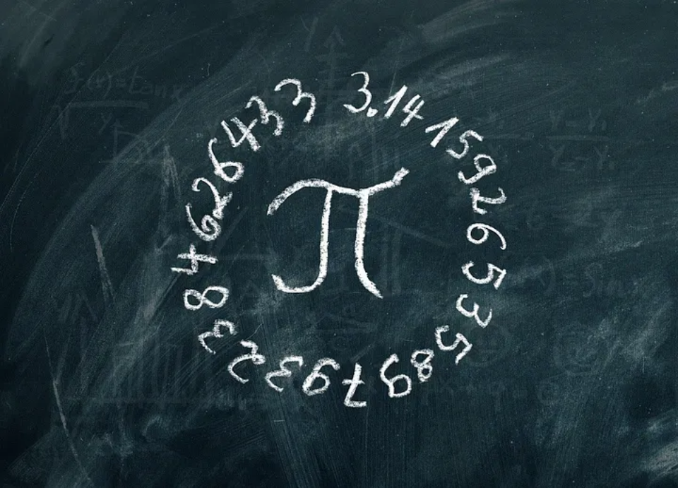

# Floating-Point Datatypes in Q/KDB+



Floating-point numbers are essential for representing real-world values that require fractional precision. These numbers are used to model quantities such as measurements, scientific data, financial calculations, and approximations of irrational numbers like \\(\pi\\). Unlike integers, which represent whole numbers, floating-point numbers allow for the representation of both very small and very large numbers by using a decimal point and an exponent.

In Q/KDB+, floating-point numbers are implemented using two primary datatypes, each suited for different levels of precision. These datatypes are built on the IEEE 754 standard, which defines formats for representing floating-point numbers in a binary system. Understanding how floating-point numbers work in Q/KDB+ is critical for efficiently handling numerical data, particularly in high-performance time series and financial applications where precision and performance are crucial.

This blog will explore how floating-point numbers behave in Q/KDB+, including their characteristics, default types, and practical considerations such as comparison tolerance and the implications of rounding errors.

## Floating-Point Datatypes in Q/KDB+

Q/KDB+ provides two primary floating-point datatypes:

* `real`: A 4-byte (32-bit) single-precision floating-point number, adhering to the *IEEE 754* standard. This type can hold approximately 6 decimal digits of precision.

* `float`: An 8-byte (64-bit) double-precision floating-point number, also based on the *IEEE 754* standard. This type supports approximately 15 decimal digits of precision.

The table below provides a concise overview of the properties of `real` and `float` datatypes:

| Type | Internal Code | Character | Size (bytes) | Example | Null | Infinity | Approx. Range | 
| ---- | ---- | ---- | ---- | ---- | ---- | ---- | ---- |
| real | `8` | `e` | `4` | `17.5e` | `0Ne` <br /> `0ne` | `0We` <br /> `0we` | \\([-3.403 \times 10^{38}, 3.403 \times 10^{38}]\\) |
| float | `9` | `f` | `8` | `17.5f` <br /> `17.5` | `0Nf` <br /> `0nf` <br /> `0n` | `0Wf` <br /> `0wf` <br /> `0w` | \\([-1.798 \times 10^{308}, 1.798 \times 10^{308}]\\) |

## Default Floating-Point Datatype

In Q/KDB+, the default floating-point type is the `float`. Any number with a decimal point and without a type character suffix will automatically be a float.

To explicitly define a `real`, the value must include the `e` suffix. Here are some examples:

```q
7.5e // Real
7.5f // Float
7.5  // Float
.1   // Float
1.   // Float  
2e3  // Float (Scientific notation)
2e3e // Real (Scientific notation)
```

### Note on Scientific Notation

Scientific notation is a compact way of expressing numbers using powers of 10. Examples include `1.23e5` for \\(1.23 \times 10^5\\). For more details, see the [Scientific Notation](#scientific-notation) section.

## Infinities and Nulls

Floating-point operations involving infinity or null values behave as expected in Q/KDB+, without wrapping like integers. For example:

```q
q)10+0we
0we
q)10+0w
0w
q)-10+0we
0we
q)-10+0w
0w
```

Division by zero produces positive or negative infinity:

```q
q)123%0
0w
q)-123%0
-0w
```

Dividing zero by zero produces a null `float`:

```q
q)0%0
0n
```

## Scientific Notation

Floating-point numbers in Q can be expressed using scientific notation, where `e` indicates the exponent:

```q
q)1.234e05
123400f
q)1.234e+5
123400f
q)1.234e5
123400f
q)1.234e-3
0.001234
```

To the right of the `e` is a signed exponent. The `+` and leading `0` for a positive exponent are optional.

To explicitly define a real in scientific notation, the `e` type suffix must be included:

```q 
q)1.234e3e
1234e
```

## Display Precision and Formatting

The Q console defaults to displaying up to 7 significant digits for floating-point values, even though the actual stored precision may be higher. You can adjust the display precision using the `\P` system command:

```q
q)\P 2
q)3.14159265358979323
3.1

q)\P 10
q)3.14159265358979323
3.141592654

q)\P 0  // Full precision (17 digits for floats - the last digit is unreliable)
q)3.14159265358979323
3.1415926535897931
```

## Comparison Tolerance

Floating-point comparisons in Q use a tolerance mechanism to account for precision limitations. This ensures that two values close to each other are considered equal:

```q
q)sum 7#1%7
0.99999999999999978

q)1f=sum 7#1%7
1b
q)1f>sum 7#1%7
0b
q)1f<sum 7#1%7
0b
```

However, only zero is tolerantly the same as zero:

```q
q)0=1e-300
0b
q)0=0
1b
```

Therefore, for intolerant comparison, one can check if 

\\[
0 = x - y
\\]

```q
q)1f=sum 7#1%7
1b
q)0=1f-sum 7#1%7
0b
```

### Built-in Comparison Tolerance

Comparison tolerance is automatically applied in the following cases:

- Operators: `=` `<` `<=` `>=` `>` `~`
- Keywords: `differ` `within`
- Iterators: Converge, Do, and While

However, comparison tolerance is not used in:

- Operators: `?`
- Keywords: `distinct` `except` `group` `in` `inter` `union` `xgroup` `asc` `desc` `iasc` `idesc` `rank` `xasc` `xdesc`

### Transitivity Caveat

```q
q)a:96.099999999999994
q)b:96.10000000001
q)c:96.10000000002

q)a=b
1b
q)b=c
1b
q)a=c
0b
```

Because of this, floats are unsuitable for use as database keys or in operations that rely on strict equality.

### Formal Definition of Tolerance

The comparison tolerance *T* in Q/KDB+ is defined as:

\\[
T = 2^{-43} \approx 1.14 \times 10^{-13}
\\]

This tolerance ensures that floating-point comparisons account for small relative differences between values.

Two floating-point values *x* and *y* are considered equal if:

\\[
| x - y | \le T \times max(|x|, |y|)
\\]

#### Why Non-Zero Values Cannot Equal Zero

Under this definition, no non-zero value can be considered equal to zero. Here's the proof:

\\[
\begin{align*}
    | x - 0 | &\gt T \times max(|x|, |0|) \\\\
    |x|       &\gt T \times |x| \\\\
    1         &\gt T
\end{align*} \qquad \forall \space x \ne 0     
\\]

Since *T* is a very small positive constant, the inequality \\(1 > T\\) always holds, making the condition true for all non-zero values of *x*.

## Additional Notes

### Floating-Point Addition is Not Associative

Due to rounding errors, the order of operations can affect the result of summing floating-point values:

```q
q)\P 0
q)x:1e-10*til 10000000
q)sum x
4999.9995000000017
q)sum reverse x
4999.9994999999999
q){x+y} over x
4999.9994999999635
q){x+y} over reverse x
4999.9995000000026
q)sum sum 2 cut x
4999.9995000000199
```

### Datetime Comparisons

`datetime` values in Q/KDB+ are stored as `float` and therefore use tolerance in comparisons:

```q
q)a:2000.01.02+sum 1000#1%86400
q)b:2000.01.02T00:16:40.000

q)a=b   // Tolerantly equal
1b
q)0=a-b // Strict comparison
0b
```

## Conclusion

Floating-point numbers are a fundamental part of numerical computing, enabling the representation of continuous and approximate values in Q/KDB+. By understanding the two main floating-point types — `real` and `float` — along with their behaviour in operations, we can make more informed decisions about precision and performance in our applications.

While Q/KDB+ handles floating-point numbers with built-in comparison tolerance to mitigate small precision errors, it’s important to be mindful of the limitations, especially when working with large datasets or performing operations that require strict equality. Whether you're using floating-point values in time series analysis, financial computations, or scientific modeling, a solid grasp of how these datatypes work will help ensure that your results are both accurate and efficient.

As always, when dealing with floating-point numbers, it's essential to choose the appropriate type based on the required precision, and to be aware of potential pitfalls like non-transitive comparisons and rounding errors. By keeping these considerations in mind, you can avoid subtle bugs and make the most of Q/KDB+'s powerful numerical capabilities.
