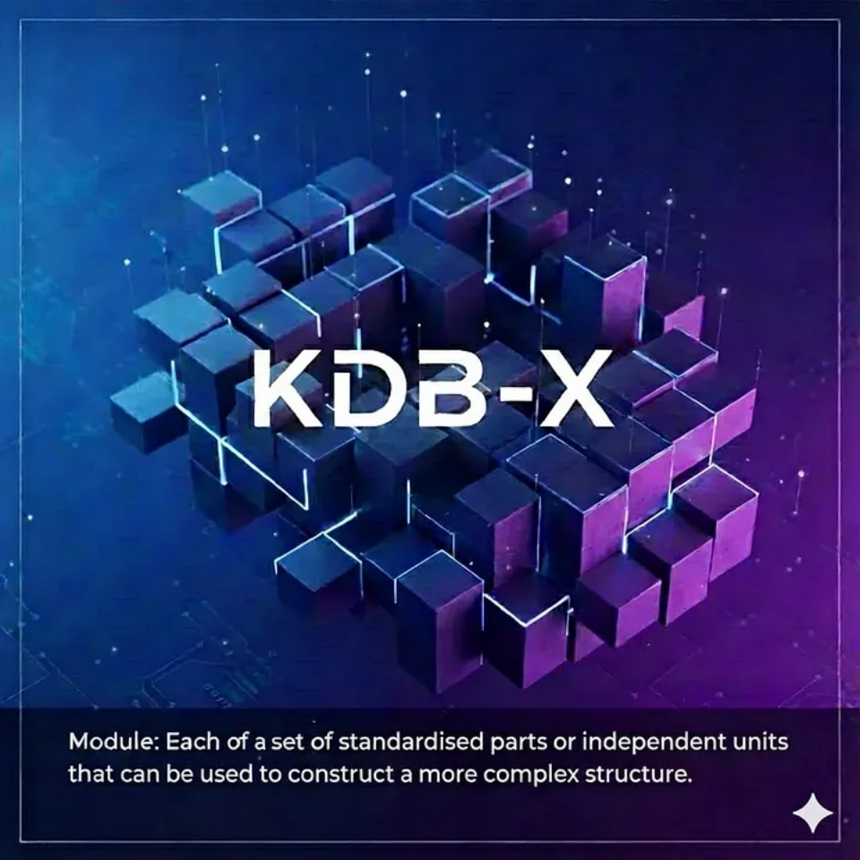

# KDB-X Modules



Most modern programming languages provide a module system to support clean encapsulation, code reuse, and easy distribution of functionality. Q/KDB+, however, historically developed without such a system. Its smaller open-source ecosystem, combined with its primarily closed-source usage inside large financial institutions, meant that developers typically relied on manually copying small `.q` files directly into their projects.

But the Q/KDB+ ecosystem has matured. As its community grows and expectations align more closely with those of other modern languages, the need for a proper module system has become clear. With the introduction of KDB-X, that gap has finally been filled: modules are now a first-class part of the language.

In this blog, we’ll explore the new KDB-X module system — how it works, how to incorporate modules created by others into your own projects, and how to develop and share your own modules with the broader community.

## What Are Modules?

In KDB-X, a module is a self-contained unit of encapsulation: it has its own local namespace to hold functions, variables, and internal state, separate from the global q environment. Modules explicitly expose parts of their interface through an `export` dictionary, allowing other code to import and use only the intended elements via the `use` function. This design supports isolation (modules do not pollute the global namespace) and portability (each module lives in a well-defined file or directory structure).

## Creating A Module

To demonstrate how to build a module in KDB-X, let’s create a simple command-line argument parser called `clap.q`.

We’ll start by defining a function to register command-line arguments. This function stores the argument name and associated metadata in a private table:

```q
// Table to hold command line arguments.
args:([name:1#`] val:1#(); default:1#(); description:1#());

// Register a command line argument to be parsed.
register:{[name;default;description] 
    `args upsert ([name;default;description]);
 };
```

Here:
- `name` - the argument name (provided as `-name` on the command line).
- `val` - the parsed value (set later when parsing).
- `default` - the default value if the argument is not supplied (see my [previous blog](./command_line_args.md) for details on how `.Q.def` handles defaults).
- `description` - a short human-readable description.

To make `register` part of our public API, we export it. The `export` dictionary lists the functions or variables intended to be visible outside the module. Here we use the dictionary-literal syntax introduced in q 4.1:

```q
export:([register]);
```

Next, the module must live somewhere on q’s module search path (see [Search path](https://code.kx.com/kdb-x/modules/module-framework/quickstart.html#search-path) in the KDB-X documentation). You could add your own directories to `QPATH`, but for simplicity we’ll copy `clap.q` into the default module directory:

```bash
$ cp clap.q $QHOME/mod/qlib/.
```

I’m using a `qlib` subdirectory to keep my own modules organised, but any name works. From here on, we will edit `$QHOME/mod/qlib/clap.q` directly.

If `QHOME` is not set, it simply refers to the root of your KX installation—for example: `/home/user/.kx/.`

We can now load our module using the new `use` keyword:

```q
q)show clap:use`qlib.clap
register| {[name;default;description]
    `args upsert ([name;default;description]);
 }
```

We see the exported `register` function, but not the private `args` table.

### Registering an Argument

Let’s register an argument:

```q
q)clap.register[`myArg; 0; "My argument of long type"]
```

No error is signalled, but we currently have no way to confirm whether it worked.

To inspect things while developing, let’s temporarily expose `args` by adding it to export:

```q
export:([args; register]);
```

Reloading in a new q session:

```q
q)clap:use`qlib.clap

q)clap.register[`myArg; 0; "My argument of long type"]

q)clap.args
name| val default description
----| -----------------------
    |  
```

The table is still empty. This illustrates a key behaviour of the module system: **exported values are copies, not references**. The module's private data remains private unless you expose explicit accessors.

Let’s add a getter:

```q
// Get the args table.
getArgs:{[] args};

// Don't forget to export getArgs.
export:([getArgs; register]);
```

If we reload using `use`, nothing appears to change:

```q
q)show clap:use`qlib.clap
args    | ...
register| ...
```

This is because q caches modules. Reloading with `use` will not re-run the module unless forced. To refresh a module in the current session without restarting q, use `.Q.m.reuse`:

```q
q)show clap:.Q.m.reuse `qlib.clap
getArgs | {[] args}
register| ...
```

Now we see the updated exports.

Registering again (since the module was reloaded) and running the `getArgs` function:

```q
q)clap.register[`myArg; 0; "My argument of long type"]

q)clap.getArgs[]
name| val default description
----| -----------------------
    |  
```

We still see an empty table. The problem is inside the `register` function itself.

When we wrote:

```q
args upsert ...
```

`args` resolves to a global variable, not the module's private variable. Indeed:

```q
q)args
name       | `myArg
default    | 0
description| "My argument of long type"
```

This is the row we attempted to upsert.

Inside module code, names appear global, but at runtime the module is wrapped in its own namespace. To modify the module’s internal state, we must assign back into the namespace explicitly:

```q
register:{[name;default;description]
    args::args upsert ([name;default;description]);
 };
```

Trying again:

```q
q)clap:.Q.m.reuse `qlib.clap

q)clap.getArgs[]                                         // Empty initially
name| val default description
----| -----------------------
    |                        

q)clap.register[`myArg; 0; "My argument of long type"]

q)clap.getArgs[]                                         // We now see the registered argument
name | val default description               
-----| --------------------------------------
     |     ()      ()                        
myArg|     0       "My argument of long type"
```

Now we see the expected row. The empty first row is simply a "type-padding" row to prevent column type promotion (e.g., `val` and `default` may contain mixed types).

### Parsing the Command-Line

After registering arguments, we need to parse the command line. First, let’s add a utility to retrieve the raw parsed arguments:

```q
// Get the raw command line values, organised into a dictionary (name-value pairs).
raw:{[] .Q.opt .z.X};

export:([getArgs; raw; register]);
```

Reload:

```q
q)clap:.Q.m.reuse `qlib.clap

q)clap.raw[]
p| "5000"
```

Now restart q with more arguments:

```bash
$ q -p 5000 -myArg1 10 -myArg2 hello
```

Then:

```q
q)clap:use`qlib.clap

q)clap.raw[]
p     | "5000" 
myArg1| "10"   
myArg2| "hello
```

To parse arguments, we need to:
1. Convert each supplied value to the correct type (falling back to the default when not supplied).
2. Update the `val` column in the `args` table.

We’ll add a `parse` function. Since `parse` is a reserved keyword in q, we define it inside the module namespace `.z.m`.

```q
// Parse command line.
.z.m.parse:{[]
    args::args upsert flip `name`val!(key;value)@\:
        exec .Q.def[name!default;.z.m.raw[]] from args;
 };

export:([getArgs; .z.m.parse; raw; register]);
```

Reload and test:

```q
q)clap:.Q.m.reuse `qlib.clap

q)clap.register[`myArg1; 0;   "Given argument of long type"]

q)clap.register[`myArg3; 0.0; "Not given argument of float type"]

q)clap.parse[]

q)clap.getArgs[]
name  | val      default description                       
------| ---------------------------------------------------
      | ()       ()      ()                                
myArg1| 10       0       "Given argument of long type"     
myArg3| 0f       0f      "Not given argument of float type"
p     | ,"5000"  ()      ()                                
myArg2| ,"hello" ()      ()
```

The results reflect:
- `myArg1` → value from the command line (`10`)
- `myArg3` → default value (`0f`)
- `myArg2` and `p` → present but unregistered, so they remain raw enlisted strings

### A Public Accessor API

`getArgs` has been useful for debugging but should not be part of a clean public API. Instead, let’s provide a simple accessor:

```q
// Get the value of an argument.
.z.m.get:{[name] args[name;`val]};   // get is reserved, so use .z.m.get

export:([.z.m.get; .z.m.parse; raw; register]);
```

Example usage (after reload, re-register, and parse):

```q
q)clap.get`myArg1
10

q)clap.get`myArg2
"hello"

q)clap.get`myArg3
0f

q)clap.get`p
"5000"

q)clap.get`nonExistingArg    // Returns ()
```

I’ve added many more features to the *clap* module, which you can find here: [jkane17/qlib](https://github.com/jkane17/qlib/tree/main).

## Sharing Your Modules

As of now, KDB-X does not yet have a dedicated package registry, largely because the module system is still new and the ecosystem is relatively small. Sharing modules is therefore straightforward: publish your code on GitHub or any similar hosting platform, and users can download it and place it into their own `mod/` directory (or anywhere else on their configured module search path).

Note that while the only requirement for sharing a module is providing the q source file(s), it’s highly recommended to include documentation describing what the module does, how to use it, and any assumptions or dependencies it has. Clear documentation makes your module far easier for others to adopt, understand, and build upon.

## Using Modules From Others

KX ships a collection of official modules with every KDB-X installation, documented [here](https://code.kx.com/kdb-x/modules/module-index.html#official-kx-modules). The same page also catalogues a range of open-source modules, which are useful both as ready-made components and as examples of good module design. To use any external module, simply download its source files and place them somewhere on your module search path — commonly within your `mod/` directory — after which it can be imported with `use` like any other module.

## Conclusion

The introduction of a module system in KDB-X marks an important step forward for the q ecosystem. Modules provide structure, encapsulation, and clarity — allowing developers to build cleaner codebases, share functionality more easily, and avoid the common pitfalls of global namespaces. Although the ecosystem is still young and a centralised package registry has yet to emerge, the foundations are now in place for a more collaborative and reusable approach to q development.

Whether you are incorporating modules written by others or creating your own, the new system offers a practical, modern way to organise and distribute functionality. As the community continues to grow, shared modules and best practices will evolve alongside it. I hope this tutorial has given you a clear understanding of how KDB-X modules work and inspired you to start building and sharing your own.
